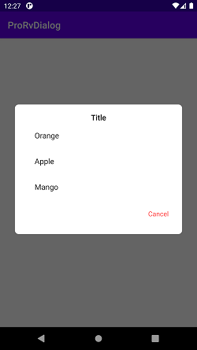

# ProListDialog
A simple library to show a list of items in a dialog. It uses the recyclerview to show the items in a dialog.

Add it in your root build.gradle at the end of repositories:

```
	allprojects {
		repositories {
			...
			maven { url 'https://jitpack.io' }
		}
	}
```
# Add the dependency

```
	dependencies {
	        implementation 'com.github.shaon2016:ProListDialog:1.0.3'
	}
```

# Screenshot


 


# How to use it

From Kotlin

In your activity or fragment

```
            RvDialog(this).show {
                title("Title")
                listValues(data) { text, position ->
                    this@MainActivity.tv.text = "Selected item: $text"
                }

                negativeButton()
            }
```

From Java

```
            new RvDialog(this)
                    .title("Title")
                    .negativeButton()
                    .listValues(items, (item, index) -> {
                        tv.setText(item);
                        return null;
                    })
                    .show();
```

Change dialog title color

``` 
            title("Title", ContextCompat.getColor(context, R.color.colorPrimaryDark))
```

Change negative button color
```
            negativeButton(textColor = resources.getColor(R.color.colorAccent))
```

# How to work with model class

In kotlin,

```
data class Item (val name: String)

val list = ArrayList<Item>()
list.add(Item("Mango"))

val data = list.map {it.name}

           RvDialog(this).show {
                title("Title")
                listValues(data) { text, position ->
                    this@MainActivity.tv.text = "Selected item: $text"
                }

                negativeButton()
            }
```
